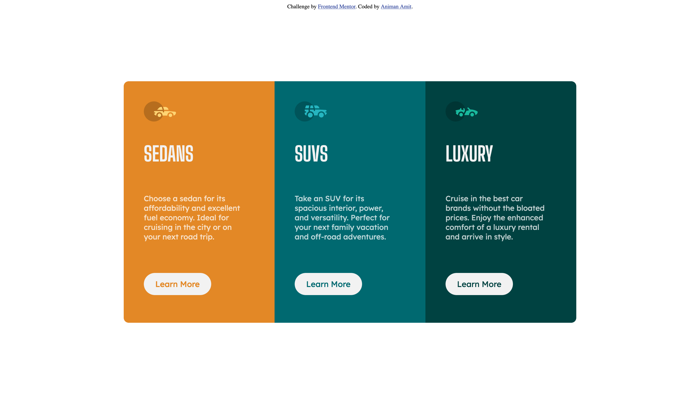

# Frontend Mentor - 3-column preview card component solution

This is a solution to the [3-column preview card component challenge on Frontend Mentor](https://www.frontendmentor.io/challenges/3column-preview-card-component-pH92eAR2-). Frontend Mentor challenges help you improve your coding skills by building realistic projects.

## Table of contents

- [Overview](#overview)
  - [The challenge](#the-challenge)
  - [Screenshot](#screenshot)
  - [Links](#links)
- [My process](#my-process)
  - [Built with](#built-with)
  - [What I learned](#what-i-learned)
  - [Continued development](#continued-development)
- [Author](#author)

## Overview

### The challenge

Users should be able to:

- View the optimal layout depending on their device's screen size
- See hover states for interactive elements

### Screenshot



Add a screenshot of your solution. The easiest way to do this is to use Firefox to view your project, right-click the page and select "Take a Screenshot". You can choose either a full-height screenshot or a cropped one based on how long the page is. If it's very long, it might be best to crop it.

Alternatively, you can use a tool like [FireShot](https://getfireshot.com/) to take the screenshot. FireShot has a free option, so you don't need to purchase it.

Then crop/optimize/edit your image however you like, add it to your project, and update the file path in the image above.

**Note: Delete this note and the paragraphs above when you add your screenshot. If you prefer not to add a screenshot, feel free to remove this entire section.**

### Links

- Solution URL: [Add solution URL here](https://your-solution-url.com)
- Live Site URL: [https://animanamit.github.io/frontendmentor-3-column-preview-card-component/](https://your-live-site-url.com)

## My process

### Built with

- Semantic HTML5 markup
- CSS custom properties
- Flexbox

### What I learned

Although it may not be the same in other situations here's how I managed to center things in this project.

```css
.how-to-center-in-middle-of-screen {
  position: fixed;
  top: 50%;
  left: 50%;
  transform: translate(-50%, -50%);
}
```

```css
.how-to-center-button-div-text {
  height: 40px;
  line-height: 40px;
}
```

### Continued development

I struggled with a number of common things in this project like centering this in the middle of the screen or in the middle of the div so I'd like to keep practicing so I know how to do that quickly and efficiently in every situation.

I would also like to focus on how I can make my CSS more concise and less clumsy because I think restructuring the HTML would allow me to reduce some lines of styling.

## Author

- Website - [Animan Amit](https://www.animanamit.dev)
- Frontend Mentor - [@animanamit](https://www.frontendmentor.io/profile/animanamit)
